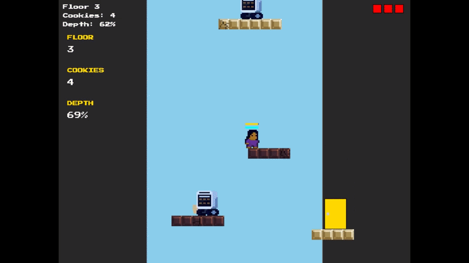
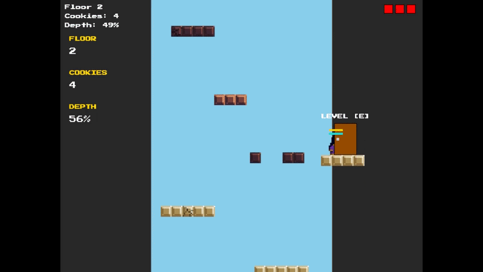
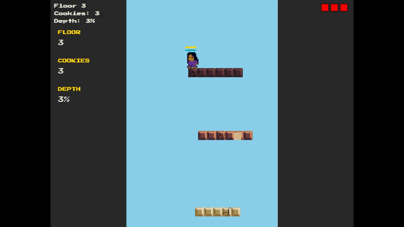
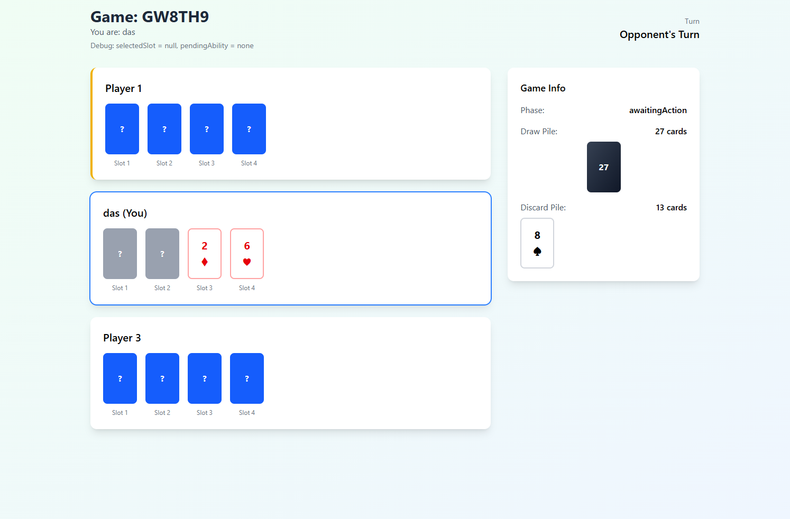

# Hi, I’m Caspian

Software Engineer focused on building practical, user-focused products. 

Currently outside of work I am currently having fun with:

## MCRobloxSkins

A [website](http://mcrobloxskins.store/) to generate roblox shirts and pants from minecraft skins.

## Cookie Thief

A fast paced 8bit sdl2 game thats heavily inspired by 1984 Bombjack by Michitaka Tsuruta as well as 2015 Downwell by Ojiro Fumoto.
Where you are a girl who loves cookies from a famous bakery a little too much and one day you steal their secret formula... only to be chased down after getting caught.

Currently working on and MVP, focusing on the enemies and feel, here's the current progress for the sharpshooter: the angry oven:

Sneak peek of the Bomb Jack-inspired side levels:

Falling through the Downwell and Dropper inspired main levels:

# 4Down

Work in progress of a web version of a game I played a lot with my family during covid:
